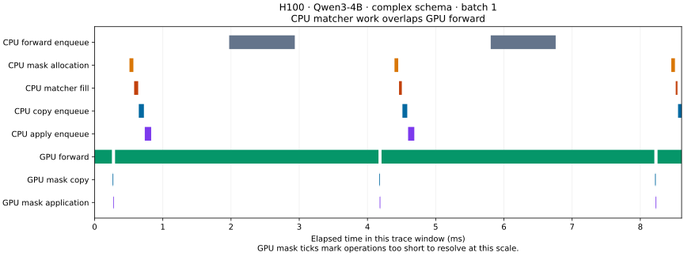

# H100 structured-output profiling results

One NVIDIA H100 80GB, Qwen3-4B-Instruct-2507 BF16, TP=1. Mainline baseline: `525f14040dd77da760b713848a803fdd4d32c2b7`; mask optimization: `9a95075`. Baseline received only the same four profiling ranges. Both ran sequentially on GPU 0 with identical settings: Triton attention, PyTorch sampling, full decode CUDA graphs for batch sizes 1/2/4, overlap scheduling enabled, prefill graphs and radix cache disabled, random seed 42, context length 4096. Model revision: `cdbee75f17c01a7cc42f958dc650907174af0554`. Runtime: PyTorch 2.13.0+cu130, XGrammar 0.2.7.

**No end-to-end speedup is demonstrated by this patch on these workloads.** CPU grammar work already overlaps GPU forward execution, and the unrestricted-mask fast path never fires for this model, including the free-text structural-tag case. These are synthetic schemas, not production workload results.

## Warm latency comparison

Each row is the median of ten unprofiled, nonstreaming native `/generate` requests after a warmup. Timings include prefill, decode, and the local HTTP round trip. Profiles were captured separately; their overhead is excluded from this table. Batch sizes are requested concurrency, with actual decode batch sizes verified in the traces. Negative change means patched was faster.

| Case | Mainline ms | Patched ms | Change | Output texts identical across revisions |
| --- | ---: | ---: | ---: | --- |
| complex-b1 | 1119.55 | 1115.30 | -0.38% | yes |
| complex-b4 | 1179.03 | 1176.82 | -0.19% | yes |
| simple-b1 | 477.73 | 479.63 | +0.40% | yes |
| simple-b4 | 536.22 | 536.28 | +0.01% | no |
| structural-b1 | 831.34 | 828.23 | -0.37% | yes |
| structural-b4 | 876.70 | 877.82 | +0.13% | yes |
| unconstrained-b1 | 476.05 | 475.60 | -0.09% | yes |
| unconstrained-b4 | 536.19 | 533.03 | -0.59% | no |

Complex outputs contained 270 tokens per request; structural-tag outputs contained 198. Simple and unconstrained requests contained 114–119 tokens. The two batch-4 rows with differing texts are not exact matched-output comparisons. The sub-percent shifts, including the unconstrained control, do not establish an optimization gain. The run order was patched then baseline; there was no randomized alternating A/B experiment.

## What the GPU traces show

The following medians are from the patched complex-schema captures. CPU ranges include profiler overhead; GPU ranges are correlated device intervals. Mask statistics include prefill fills, while the forward row uses only decode spans. Do not add CPU durations to overlapping GPU durations.

| Stage | Batch 1 µs | Batch 4 µs |
| --- | ---: | ---: |
| CPU allocation range | 52.14 | 50.81 |
| CPU matcher fill | 23.17 | 30.65 |
| CPU transfer enqueue range | 68.96 | 64.76 |
| CPU application enqueue range | 85.16 | 79.52 |
| GPU mask copy | 2.51 | 3.65 |
| GPU mask application | 2.05 | 3.55 |
| CPU `aten::full` inside allocation | 21.30 | 22.17 |
| GPU decode forward | 4063.65 | 4190.24 |

At batch 1, **269/270 matcher fills were entirely inside a GPU decode forward interval**; at batch 4, 269/271 were. The unmatched fills include prefill. This is direct timeline evidence of existing CPU/GPU overlap, not an estimate from summing timings. Batch-4 matcher fill p95 was 132.95 µs; GPU decode forward median was 4190.24 µs.



The figure shows two adjacent decode forwards beginning at zero-based index 100.
Generate another window with `plot_trace.py TRACE.trace.json.gz OUTPUT.svg --step 100`.

Both constrained captures contain `grammar.fill`, actual H2D copies, the `apply_token_bitmask_inplace_kernel` GPU kernel, and model-forward GPU spans. The unconstrained captures contain forward spans but no grammar ranges. We now have forward-pass profiles that explicitly verify structured output was used.

## Why mask skipping did not trigger

Every fill in the JSON and structural-tag captures was followed by transfer and application. A direct check using SGLang’s real `XGrammarGrammarBackend` found that the initial free-text structural-tag state denied exactly token IDs 151669 through 151935. The model has 151936 output slots but the tokenizer has 151669 entries. These 267 padded slots alone keep `need_apply=True`, even outside the tagged JSON. Skipping that mask would change allowed tokens.

The fast path remains useful for backends/states that truly return `False`; the real CUDA regression test verifies that case with a dense toy vocabulary, mixed restricted/unrestricted rows, and termination transitions. It is not a demonstrated performance improvement for this Qwen vocabulary.

## Implications

- Model forward dominates this configuration. Additional CPU/forward scheduling overlap is not the first priority: it is already present.
- Buffer reuse could remove CPU allocation work (about 21–22 µs for `aten::full` under profiling), but much of the CPU mask work is hidden by the model forward. End-to-end benefit needs a separate measured patch, with host-copy and device-consumer lifetimes protected.
- Handling padded vocabulary separately could make more states eligible for skipping, but must still prohibit padded token IDs. This was investigated, not implemented.
- TP synchronization, other models, llguidance, speculative decoding, and production schemas were not benchmarked.

## Validation and artifacts

All **330 constrained responses** across both revisions, timed runs, and captures passed JSON Schema validation (including extraction and validation of the tagged JSON). All finished by stop token rather than truncation. **113 tests passed**, including the real CUDA mixed-row regression; two profiling-client protocol/summary tests also passed. CPU/GPU annotation categories are summarized separately to avoid double-counting GPU annotations as CPU time.

Numerical results and raw artifact paths: [h100-results.json](h100-results.json). Local evidence directory: `/workspace/model-performance/michaelfeil/sglang-gpu-evidence`. It contains 16 valid compressed GPU traces (about 60 MB total), manifests with exact requests/responses and server configuration, the baseline instrumentation patch, package versions, GPU information, padding diagnostic, and test logs. An initial failed idle capture is isolated in `failed-capture/` and excluded from results. Benchmark servers have been stopped.

## Reproduce

Use the same launch command for each checkout, with `PYTHONPATH` pointing to that checkout’s `python` directory:
Apply [baseline-instrumentation.patch](baseline-instrumentation.patch) to the stated
mainline commit for the baseline capture; it adds annotations only.

```bash
CUDA_VISIBLE_DEVICES=0 PYTHONPATH=python python -m sglang.launch_server \
  --model-path Qwen/Qwen3-4B-Instruct-2507 \
  --revision cdbee75f17c01a7cc42f958dc650907174af0554 \
  --host 127.0.0.1 --port 31000 --grammar-backend xgrammar \
  --attention-backend triton --sampling-backend pytorch \
  --mem-fraction-static 0.5 --max-running-requests 4 \
  --cuda-graph-bs-decode 1 2 4 --cuda-graph-backend-prefill disabled \
  --context-length 4096 --disable-radix-cache --random-seed 42
```

The example prompts are already formatted with Qwen ChatML. Set `VARIANT` to `baseline` or `patched` and `EVIDENCE` to an absolute directory on the shared client/server filesystem:

```bash
python benchmark/structured_output/profile_masks.py run \
  --url http://127.0.0.1:31000 \
  --schema benchmark/structured_output/example-schema.json \
  --prompt benchmark/structured_output/example-prompt.txt \
  --output "$EVIDENCE/$VARIANT" --trace-dir "$EVIDENCE/$VARIANT-traces" \
  --max-tokens 512 --repeats 10

python benchmark/structured_output/profile_masks.py run \
  --url http://127.0.0.1:31000 \
  --schema benchmark/structured_output/example-schema.json \
  --prompt benchmark/structured_output/example-tagged-prompt.txt --cases structural \
  --output "$EVIDENCE/$VARIANT" --trace-dir "$EVIDENCE/$VARIANT-traces" \
  --max-tokens 512 --repeats 10

python benchmark/structured_output/analyze_results.py "$EVIDENCE" > results.json
```
